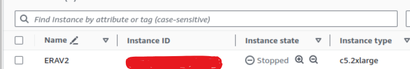

# Training and Inferencing using AWS EC2 and SageMaker for CIFAR-10 using Pytorch and Pytorch Lightning

## Repository Details

### SageMaker
- `S14.ipynb`: Notebook containing the main code for training in SageMaker

### EC2
- `S14.ipynb`: Notebook containing the main code for training in EC2

## Code Details

- Code details for Training and Inferencing usiing **AWS EC2** can be found at: https://github.com/Shivdutta/ERA2-Session13

- Code details for Training and Inferencing usiing **SageMaker** can be found at: https://github.com/Shivdutta/ERA2-Session11

- **Master Repo** for reusable libraries: https://github.com/Shivdutta/ERA2-Master 

## Setup and Configuration:

### SageMaker
- There are 2 ways we can train model in SageMaker:
     - Using Amazon SageMaker Studio
     - Notebook Instance
- Notebook Instance : After login, we need to request for Service Request Quota for  ml.g4dn.2xlarge for notebook instance usage.
  This is equivalent to T4 in colab.
- Once the access is provided, we can configure notebook instance
- Once the notebook is ready, we can upload the file and run


### EC2
 - After login, we need to request for Service Request Quota for  ml.g4dn.2xlarge GPU. 
     - Under Amazon Elastic Compute Cloud (Amazon EC2)
          - All G and VT Spot Instance Requests
 - Once the access is provided, we can configure EC2 instance through EC2 launch by following steps:
     - Provide EC2 Instance name
     - Select OS - Ubuntu
     - Select AMI Type - Deep Learning OSS Nvidia Driver AMI GPU PyTorch 2.2.0 (Ubuntu 20.04)
     - SSH - pem file to be generated
     - Instance type c5.2xlarge
     - Note Deep Learing Instance type should be ml.g4dn.2xlarge. But due to non avilability of ml.g4dn.2xlarge,
       I have used c5.2xlarge(which may be cause of low LR)
     

## Model Summary:

### SageMaker
```python
Trainer already configured with model summary callbacks: [<class 'pytorch_lightning.callbacks.model_summary.ModelSummary'>]. Skipping setting a default `ModelSummary` callback.
GPU available: True (cuda), used: True
TPU available: False, using: 0 TPU cores
IPU available: False, using: 0 IPUs
HPU available: False, using: 0 HPUs
Files already downloaded and verified
Files already downloaded and verified
LOCAL_RANK: 0 - CUDA_VISIBLE_DEVICES: [0]

   | Name                | Type               | Params
------------------------------------------------------------
0  | inv_normalize       | Normalize          | 0     
1  | accuracy            | MulticlassAccuracy | 0     
2  | conv1               | Conv2d             | 1.7 K 
3  | bn1                 | BatchNorm2d        | 128   
4  | layer1              | Sequential         | 147 K 
5  | layer1.0            | BasicBlock         | 74.0 K
6  | layer1.0.conv1      | Conv2d             | 36.9 K
7  | layer1.0.bn1        | BatchNorm2d        | 128   
8  | layer1.0.conv2      | Conv2d             | 36.9 K
9  | layer1.0.bn2        | BatchNorm2d        | 128   
10 | layer1.0.shortcut   | Sequential         | 0     
11 | layer1.1            | BasicBlock         | 74.0 K
12 | layer1.1.conv1      | Conv2d             | 36.9 K
13 | layer1.1.bn1        | BatchNorm2d        | 128   
14 | layer1.1.conv2      | Conv2d             | 36.9 K
15 | layer1.1.bn2        | BatchNorm2d        | 128   
16 | layer1.1.shortcut   | Sequential         | 0     
17 | layer2              | Sequential         | 525 K 
18 | layer2.0            | BasicBlock         | 230 K 
19 | layer2.0.conv1      | Conv2d             | 73.7 K
20 | layer2.0.bn1        | BatchNorm2d        | 256   
21 | layer2.0.conv2      | Conv2d             | 147 K 
22 | layer2.0.bn2        | BatchNorm2d        | 256   
23 | layer2.0.shortcut   | Sequential         | 8.4 K 
24 | layer2.0.shortcut.0 | Conv2d             | 8.2 K 
25 | layer2.0.shortcut.1 | BatchNorm2d        | 256   
26 | layer2.1            | BasicBlock         | 295 K 
27 | layer2.1.conv1      | Conv2d             | 147 K 
28 | layer2.1.bn1        | BatchNorm2d        | 256   
29 | layer2.1.conv2      | Conv2d             | 147 K 
30 | layer2.1.bn2        | BatchNorm2d        | 256   
31 | layer2.1.shortcut   | Sequential         | 0     
32 | layer3              | Sequential         | 2.1 M 
33 | layer3.0            | BasicBlock         | 919 K 
34 | layer3.0.conv1      | Conv2d             | 294 K 
35 | layer3.0.bn1        | BatchNorm2d        | 512   
36 | layer3.0.conv2      | Conv2d             | 589 K 
37 | layer3.0.bn2        | BatchNorm2d        | 512   
38 | layer3.0.shortcut   | Sequential         | 33.3 K
39 | layer3.0.shortcut.0 | Conv2d             | 32.8 K
40 | layer3.0.shortcut.1 | BatchNorm2d        | 512   
41 | layer3.1            | BasicBlock         | 1.2 M 
42 | layer3.1.conv1      | Conv2d             | 589 K 
43 | layer3.1.bn1        | BatchNorm2d        | 512   
44 | layer3.1.conv2      | Conv2d             | 589 K 
45 | layer3.1.bn2        | BatchNorm2d        | 512   
46 | layer3.1.shortcut   | Sequential         | 0     
47 | layer4              | Sequential         | 8.4 M 
48 | layer4.0            | BasicBlock         | 3.7 M 
49 | layer4.0.conv1      | Conv2d             | 1.2 M 
50 | layer4.0.bn1        | BatchNorm2d        | 1.0 K 
51 | layer4.0.conv2      | Conv2d             | 2.4 M 
52 | layer4.0.bn2        | BatchNorm2d        | 1.0 K 
53 | layer4.0.shortcut   | Sequential         | 132 K 
54 | layer4.0.shortcut.0 | Conv2d             | 131 K 
55 | layer4.0.shortcut.1 | BatchNorm2d        | 1.0 K 
56 | layer4.1            | BasicBlock         | 4.7 M 
57 | layer4.1.conv1      | Conv2d             | 2.4 M 
58 | layer4.1.bn1        | BatchNorm2d        | 1.0 K 
59 | layer4.1.conv2      | Conv2d             | 2.4 M 
60 | layer4.1.bn2        | BatchNorm2d        | 1.0 K 
61 | layer4.1.shortcut   | Sequential         | 0     
62 | linear              | Linear             | 5.1 K 
------------------------------------------------------------
11.2 M    Trainable params
0         Non-trainable params
11.2 M    Total params
44.696    Total estimated model params size (MB)
```

### EC2
```python
----------------------------------------------------------------
        Layer (type)               Output Shape         Param #
================================================================
            Conv2d-1           [-1, 64, 32, 32]           1,728
       BatchNorm2d-2           [-1, 64, 32, 32]             128
            Conv2d-3           [-1, 64, 32, 32]          36,864
       BatchNorm2d-4           [-1, 64, 32, 32]             128
            Conv2d-5           [-1, 64, 32, 32]          36,864
       BatchNorm2d-6           [-1, 64, 32, 32]             128
        BasicBlock-7           [-1, 64, 32, 32]               0
            Conv2d-8           [-1, 64, 32, 32]          36,864
       BatchNorm2d-9           [-1, 64, 32, 32]             128
           Conv2d-10           [-1, 64, 32, 32]          36,864
      BatchNorm2d-11           [-1, 64, 32, 32]             128
       BasicBlock-12           [-1, 64, 32, 32]               0
           Conv2d-13          [-1, 128, 16, 16]          73,728
      BatchNorm2d-14          [-1, 128, 16, 16]             256
           Conv2d-15          [-1, 128, 16, 16]         147,456
      BatchNorm2d-16          [-1, 128, 16, 16]             256
           Conv2d-17          [-1, 128, 16, 16]           8,192
      BatchNorm2d-18          [-1, 128, 16, 16]             256
       BasicBlock-19          [-1, 128, 16, 16]               0
           Conv2d-20          [-1, 128, 16, 16]         147,456
      BatchNorm2d-21          [-1, 128, 16, 16]             256
           Conv2d-22          [-1, 128, 16, 16]         147,456
      BatchNorm2d-23          [-1, 128, 16, 16]             256
       BasicBlock-24          [-1, 128, 16, 16]               0
           Conv2d-25            [-1, 256, 8, 8]         294,912
      BatchNorm2d-26            [-1, 256, 8, 8]             512
           Conv2d-27            [-1, 256, 8, 8]         589,824
      BatchNorm2d-28            [-1, 256, 8, 8]             512
           Conv2d-29            [-1, 256, 8, 8]          32,768
      BatchNorm2d-30            [-1, 256, 8, 8]             512
       BasicBlock-31            [-1, 256, 8, 8]               0
           Conv2d-32            [-1, 256, 8, 8]         589,824
      BatchNorm2d-33            [-1, 256, 8, 8]             512
           Conv2d-34            [-1, 256, 8, 8]         589,824
      BatchNorm2d-35            [-1, 256, 8, 8]             512
       BasicBlock-36            [-1, 256, 8, 8]               0
           Conv2d-37            [-1, 512, 4, 4]       1,179,648
      BatchNorm2d-38            [-1, 512, 4, 4]           1,024
           Conv2d-39            [-1, 512, 4, 4]       2,359,296
      BatchNorm2d-40            [-1, 512, 4, 4]           1,024
           Conv2d-41            [-1, 512, 4, 4]         131,072
      BatchNorm2d-42            [-1, 512, 4, 4]           1,024
       BasicBlock-43            [-1, 512, 4, 4]               0
           Conv2d-44            [-1, 512, 4, 4]       2,359,296
      BatchNorm2d-45            [-1, 512, 4, 4]           1,024
           Conv2d-46            [-1, 512, 4, 4]       2,359,296
      BatchNorm2d-47            [-1, 512, 4, 4]           1,024
       BasicBlock-48            [-1, 512, 4, 4]               0
           Linear-49                   [-1, 10]           5,130
================================================================
Total params: 11,173,962
Trainable params: 11,173,962
Non-trainable params: 0
----------------------------------------------------------------
Input size (MB): 0.01
Forward/backward pass size (MB): 11.25
Params size (MB): 42.63
Estimated Total Size (MB): 53.89
----------------------------------------------------------------
```

## Training logs:

### SageMaker
```python
Training: |          | 0/? [00:00<?, ?it/s]
Epoch 0, global step 88: 'val_loss' reached -3.83905 (best -3.83905), saving model to '/home/ec2-user/SageMaker/lightning_logs/version_2/checkpoints/epoch=0-step=88.ckpt' as top 1
Epoch 1, global step 176: 'val_loss' was not in top 1
Epoch 2, global step 264: 'val_loss' was not in top 1
Epoch 3, global step 352: 'val_loss' was not in top 1
Epoch 4, global step 440: 'val_loss' was not in top 1
Epoch 5, global step 528: 'val_loss' was not in top 1
Epoch 6, global step 616: 'val_loss' was not in top 1
Epoch 7, global step 704: 'val_loss' was not in top 1
Epoch 8, global step 792: 'val_loss' was not in top 1
Epoch 9, global step 880: 'val_loss' was not in top 1
Epoch 10, global step 968: 'val_loss' was not in top 1
Epoch 11, global step 1056: 'val_loss' was not in top 1
Epoch 12, global step 1144: 'val_loss' was not in top 1
Epoch 13, global step 1232: 'val_loss' was not in top 1
Epoch 14, global step 1320: 'val_loss' was not in top 1
Epoch 15, global step 1408: 'val_loss' was not in top 1
Epoch 16, global step 1496: 'val_loss' reached -4.48738 (best -4.48738), saving model to '/home/ec2-user/SageMaker/lightning_logs/version_2/checkpoints/epoch=16-step=1496.ckpt' as top 1
Epoch 17, global step 1584: 'val_loss' was not in top 1
Epoch 18, global step 1672: 'val_loss' reached -4.55049 (best -4.55049), saving model to '/home/ec2-user/SageMaker/lightning_logs/version_2/checkpoints/epoch=18-step=1672.ckpt' as top 1
Epoch 19, global step 1760: 'val_loss' reached -5.58175 (best -5.58175), saving model to '/home/ec2-user/SageMaker/lightning_logs/version_2/checkpoints/epoch=19-step=1760.ckpt' as top 1
Epoch 20, global step 1848: 'val_loss' was not in top 1
Epoch 21, global step 1936: 'val_loss' reached -5.96343 (best -5.96343), saving model to '/home/ec2-user/SageMaker/lightning_logs/version_2/checkpoints/epoch=21-step=1936.ckpt' as top 1
Epoch 22, global step 2024: 'val_loss' reached -6.69782 (best -6.69782), saving model to '/home/ec2-user/SageMaker/lightning_logs/version_2/checkpoints/epoch=22-step=2024.ckpt' as top 1
Epoch 23, global step 2112: 'val_loss' reached -7.46363 (best -7.46363), saving model to '/home/ec2-user/SageMaker/lightning_logs/version_2/checkpoints/epoch=23-step=2112.ckpt' as top 1
`Trainer.fit` stopped: `max_epochs=24` reached.
```

### EC2
```python
Epoch 1
Train: Loss=1.4987 Batch_id=781 Accuracy=48.21: 100%|██████████| 782/782 [07:25<00:00,  1.76it/s]
Test set: Average loss: 0.0186, Accuracy: 6012/10000 (60.12%)

Epoch 2
Train: Loss=0.9724 Batch_id=781 Accuracy=67.51: 100%|██████████| 782/782 [07:28<00:00,  1.74it/s]
Test set: Average loss: 0.0139, Accuracy: 7106/10000 (71.06%)

Epoch 3
Train: Loss=0.5251 Batch_id=781 Accuracy=75.12: 100%|██████████| 782/782 [07:28<00:00,  1.74it/s]
Test set: Average loss: 0.0141, Accuracy: 7118/10000 (71.18%)

Epoch 4
Train: Loss=0.3086 Batch_id=781 Accuracy=78.98: 100%|██████████| 782/782 [07:28<00:00,  1.74it/s]
Test set: Average loss: 0.0099, Accuracy: 7754/10000 (77.54%)

Epoch 5
Train: Loss=0.5561 Batch_id=781 Accuracy=81.82: 100%|██████████| 782/782 [07:28<00:00,  1.74it/s]
Test set: Average loss: 0.0089, Accuracy: 8081/10000 (80.81%)

Epoch 6
Train: Loss=0.1708 Batch_id=781 Accuracy=83.78: 100%|██████████| 782/782 [07:29<00:00,  1.74it/s]
Test set: Average loss: 0.0085, Accuracy: 8197/10000 (81.97%)

Epoch 7
Train: Loss=0.2761 Batch_id=781 Accuracy=85.61: 100%|██████████| 782/782 [07:28<00:00,  1.74it/s]
Test set: Average loss: 0.0091, Accuracy: 8115/10000 (81.15%)

Epoch 8
Train: Loss=0.3408 Batch_id=781 Accuracy=87.35: 100%|██████████| 782/782 [07:30<00:00,  1.74it/s]
Test set: Average loss: 0.0073, Accuracy: 8410/10000 (84.10%)

Epoch 9
Train: Loss=0.8746 Batch_id=781 Accuracy=88.45: 100%|██████████| 782/782 [07:30<00:00,  1.74it/s]
Test set: Average loss: 0.0074, Accuracy: 8465/10000 (84.65%)

Epoch 10
Train: Loss=0.2742 Batch_id=781 Accuracy=89.78: 100%|██████████| 782/782 [07:29<00:00,  1.74it/s]
Test set: Average loss: 0.0069, Accuracy: 8574/10000 (85.74%)

Epoch 11
Train: Loss=0.1393 Batch_id=781 Accuracy=91.13: 100%|██████████| 782/782 [07:28<00:00,  1.74it/s]
Test set: Average loss: 0.0068, Accuracy: 8582/10000 (85.82%)

Epoch 12
Train: Loss=0.1103 Batch_id=781 Accuracy=91.64: 100%|██████████| 782/782 [07:29<00:00,  1.74it/s]
Test set: Average loss: 0.0069, Accuracy: 8605/10000 (86.05%)

Epoch 13
Train: Loss=0.5136 Batch_id=781 Accuracy=92.70: 100%|██████████| 782/782 [07:29<00:00,  1.74it/s]
Test set: Average loss: 0.0065, Accuracy: 8679/10000 (86.79%)

Epoch 14
Train: Loss=0.3791 Batch_id=781 Accuracy=93.46: 100%|██████████| 782/782 [07:29<00:00,  1.74it/s]
Test set: Average loss: 0.0075, Accuracy: 8509/10000 (85.09%)

Epoch 15
Train: Loss=0.1148 Batch_id=781 Accuracy=94.31: 100%|██████████| 782/782 [07:29<00:00,  1.74it/s]
Test set: Average loss: 0.0068, Accuracy: 8688/10000 (86.88%)

Epoch 16
Train: Loss=0.1327 Batch_id=781 Accuracy=94.76: 100%|██████████| 782/782 [07:30<00:00,  1.74it/s]
Test set: Average loss: 0.0064, Accuracy: 8743/10000 (87.43%)

Epoch 17
Train: Loss=0.1705 Batch_id=781 Accuracy=95.34: 100%|██████████| 782/782 [07:30<00:00,  1.73it/s]
Test set: Average loss: 0.0067, Accuracy: 8774/10000 (87.74%)

Epoch 18
Train: Loss=0.0230 Batch_id=781 Accuracy=95.92: 100%|██████████| 782/782 [07:30<00:00,  1.74it/s]
Test set: Average loss: 0.0067, Accuracy: 8738/10000 (87.38%)

Epoch 19
Train: Loss=0.0267 Batch_id=781 Accuracy=96.60: 100%|██████████| 782/782 [07:30<00:00,  1.74it/s]
Test set: Average loss: 0.0066, Accuracy: 8802/10000 (88.02%)

Epoch 20
Train: Loss=0.2133 Batch_id=781 Accuracy=97.27: 100%|██████████| 782/782 [07:32<00:00,  1.73it/s]
Test set: Average loss: 0.0066, Accuracy: 8859/10000 (88.59%)

Epoch 21
Train: Loss=0.0107 Batch_id=781 Accuracy=97.95: 100%|██████████| 782/782 [07:30<00:00,  1.74it/s]
Test set: Average loss: 0.0064, Accuracy: 8920/10000 (89.20%)

Epoch 22
Train: Loss=0.0469 Batch_id=781 Accuracy=98.45: 100%|██████████| 782/782 [07:30<00:00,  1.74it/s]
Test set: Average loss: 0.0060, Accuracy: 8996/10000 (89.96%)

Epoch 23
Train: Loss=0.0006 Batch_id=781 Accuracy=98.99: 100%|██████████| 782/782 [07:31<00:00,  1.73it/s]
Test set: Average loss: 0.0059, Accuracy: 9010/10000 (90.10%)

Epoch 24
Train: Loss=0.4343 Batch_id=781 Accuracy=99.26: 100%|██████████| 782/782 [07:32<00:00,  1.73it/s]
Test set: Average loss: 0.0058, Accuracy: 9031/10000 (90.31%)
```
